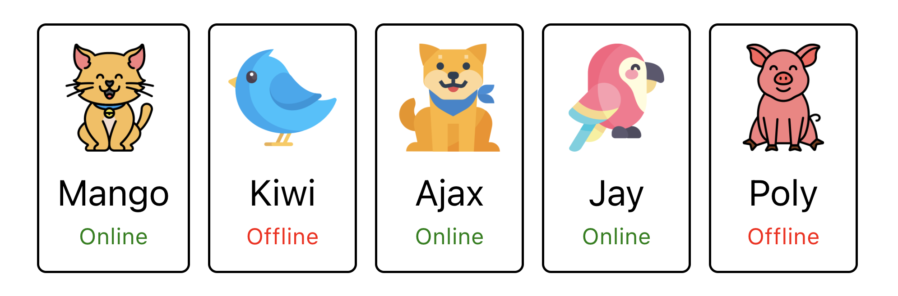
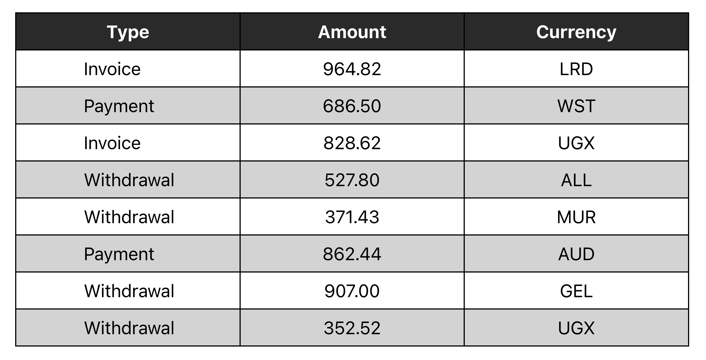

# Tier 4. Module 1: Mastering Front-End Development with React

## Topic 1 - Introduction to React.JSX. Props. Collections
## Topic 2 - Stylization

## Homework

### Technical task

#### Task 1 - Social network profile

It's required to create a `<Profile>` component with which we can display information about a social network user.

The component should accept several props with information about the user:

* `name` — user name;
* `tag` — a tag in a social network without `@`;
* `location` — city and country;
* `image` — a link to an image;
* `stats` — an object with information about activities.

The component must create markup with dynamic data coming in the form of props described earlier.

An example of using the `Profile` component in the `App` component:

* Render the `Profile` component inside the `App`;
* Transfer data to the `Profile` component in the form of props.

It is necessary to export the user data to a JSON file in order not to load the `App` component. For example, create a `userData.json` file in the `src` folder, put the user data in there, format it into JSON, and then import it into the `App` to pass that data through the props.

#### Task 2 - Friends list

It's required to create a `<FriendList>` component with which we can display information about the user's friends.

The `<FriendList>` component must accept one `friends` prop - an array of friends objects and create DOM markup.

The `<FriendListItem>` component is a single friend card that should accept multiple props:

* `avatar` — link to the avatar;
* `name` — friend's name;
* `isOnline` — a boolean indicating the state of a friend: online or not.

Depending on the `isOnline` prop, the text in `p.status` should change, and so should its text color. If the value is `true`, the text is `Online` and the text color is green, otherwise the text is `Offline` and the text color is red. This can be done using various CSS classes.

It is necessary to export data about friends to a JSON file in order not to complicate the `App` component. For example, create a `friends.json` file in the `src` folder, move an array of friends into it, formatting the data in JSON format, and then import it into the `App` to pass that data to the props.

#### Task 3 - Transaction history

It is necessary to create a transaction history component in the personal account of the Internet bank.

The data for the list is available in the form of an array of objects, where each object describes a single transaction with the following properties:

* `id` — unique identifier of the transaction;
* `type` — transaction type;
* `amount` — transaction amount;
* `currency` — type of currency.

It is necessary to create a component `<TransactionHistory>`, which accepts one prop `items` — an array of transaction objects. The component creates table markup. Each transaction is a table row.

It's required to export the transaction data to a JSON file so as not to clutter the `App` component. For example, create a file called `transactions.json` in the `src` folder, move the transactions array there, format the data into JSON, and then import it into the `App` component to pass the data as props.

### Acceptance criteria

* Main link: the assignment work page on [Vercel](https://goit-neo-react-hw-module1-olive.vercel.app/).
* The project was created using [Vite](https://vitejs.dev/).
* When visiting the live task page, there are no errors or warnings in the console.
* For each component, there is a separate folder in the `src/components` folder that contains the JSX file of the React component itself and its styles file. The name of the folder, the component file (with the extension `.jsx`) and the style file (before `.module.css`) are the same and correspond to the names specified in the tasks (if there were any)
* `Export default` is used to export components.
* All task components are rendered on the same page, inside the root `<App>` component.
* Anything the component expects as props is passed to it when called.
* The JS code is clean and clear, using **Prettier**.
* Styling is done by **CSS modules**.
